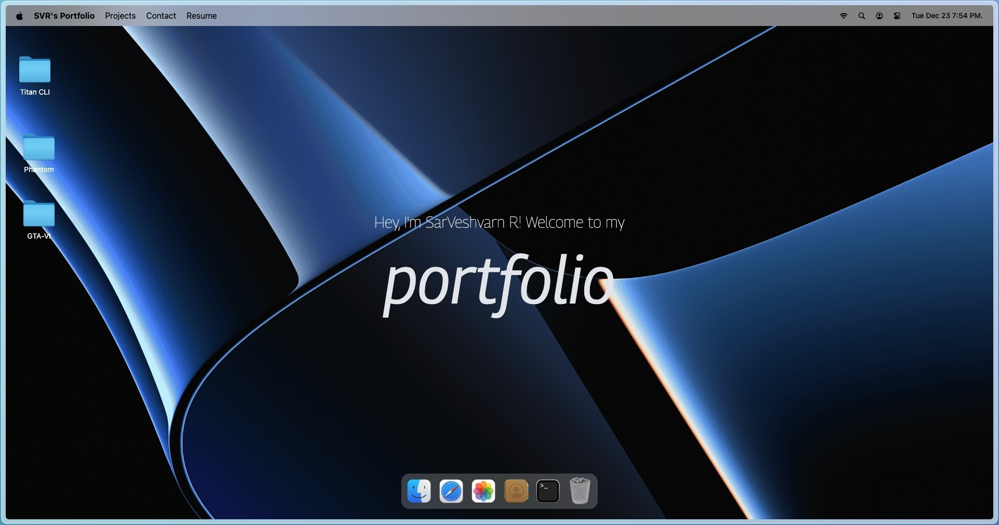

# MacFolio

A personal portfolio project built with React and Vite.



## Overview

MacFolio is designed to be a responsive and interactive portfolio application. It leverages the speed of Vite and the component-based architecture of React to deliver a smooth user experience.

## Features

*   **React**: UI built with React.
*   **Vite**: Fast development server and build tool.
*   **ESLint**: Integrated code linting.

## Getting Started

### Prerequisites

Ensure you have Node.js installed on your machine.

### Installation

1.  Clone the repository:
    ```bash
    git clone <repository_url>
    ```
2.  Navigate to the project folder:
    ```bash
    cd macFolio
    ```
3.  Install dependencies:
    ```bash
    npm install
    ```

### Scripts

*   `npm run dev`: Starts the development server.
*   `npm run build`: Builds the app for production.
*   `npm run lint`: Runs ESLint to check for code quality issues.
*   `npm run preview`: Locally preview the production build.

## License

This project is licensed under the MIT License.
